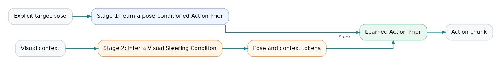
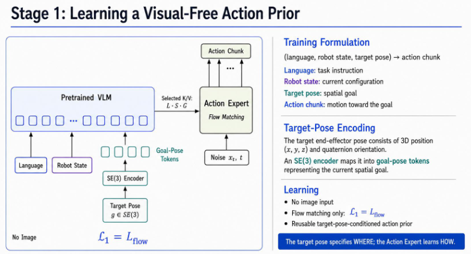
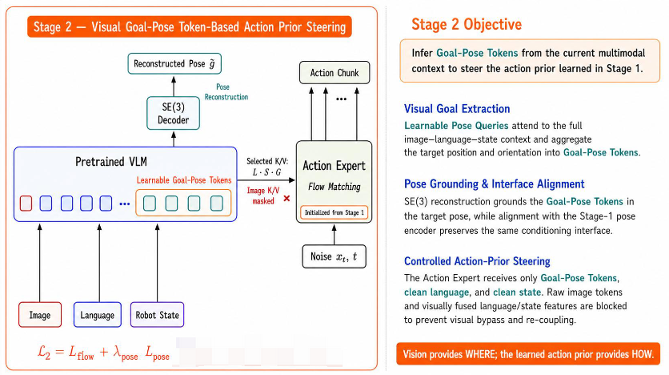
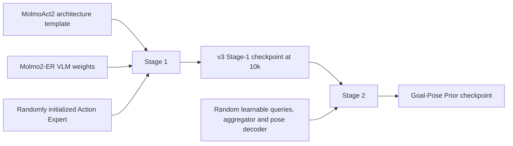

# Learning Visually Steerable Action Priors for Visual Generalization in Robot Manipulation

> **Decoupling visual goal inference from goal-conditioned motion generation.**

This document presents the research problem, the two-stage method, supporting LIBERO results, the v3 normalization correction, and the complete reproduction path. First-time readers may follow the sections sequentially; readers reproducing the method can proceed directly to Sections 5 and 6.

**Quick navigation**

<table>
  <tr>
    <td align="center"><a href="#1-background"><strong>Background</strong></a></td>
    <td align="center"><a href="#2-motivation"><strong>Motivation</strong></a></td>
    <td align="center"><a href="#3-method"><strong>Two-Stage Method</strong></a></td>
    <td align="center"><a href="#4-libero-results"><strong>Results</strong></a></td>
  </tr>
  <tr>
    <td align="center"><a href="#5-current-v3-pipeline-corrected-quantile-statistics"><strong>v3 &amp; Normalization</strong></a></td>
    <td align="center"><a href="#6-reproducing-the-method"><strong>Reproduction</strong></a></td>
    <td align="center"><a href="#7-key-paths"><strong>Key Paths</strong></a></td>
    <td align="center"><a href="EXPERIMENTS.md"><strong>Experiment Log</strong></a></td>
  </tr>
</table>

This project first learns a vision-independent action prior conditioned on a target pose, and subsequently learns to aggregate from visual context the steering condition required to invoke that prior. The recommended training pipeline is **v3**, which retains the v2b architecture while retraining both stages with corrected state/action quantile statistics.

## 1. Background

Prior analysis suggests that zero-shot out-of-distribution (OOD) failures in vision-language-action models do not necessarily originate from a loss of perceptual competence. The VLM may still interpret the instruction, recognize relevant objects, and localize task-relevant regions, while the Action Expert continues to query this information. Nevertheless, the model can fail to translate the available multimodal evidence into accurate and executable trajectories.

The VLM and the Action Expert acquire their capabilities from fundamentally different sources:

| Component | Source of capability | Potential limitation |
| --- | --- | --- |
| VLM | Large-scale vision-language pretraining | Typically provides transferable perception across objects, appearances, and scenes |
| Action Expert | Trained from scratch on a comparatively limited set of robot demonstrations | Can acquire dataset-specific visual–trajectory associations |

When the Action Expert is fully conditioned on vision from the beginning of training, visual features not only specify the intended spatial goal but also participate in shaping the trajectory-generation process. Consequently, motion generation may become coupled to the appearances, camera configurations, and spatial layouts observed in the robot training distribution.

## 2. Motivation

**Research Question.** How can we learn an action prior that captures reusable motion structure without being tied to the visual distribution of the training environments, while remaining effectively steerable by the spatial goal in the current scene?

**Key Idea.** We first learn a visual-free, target-pose-conditioned Action Prior that models how to move toward a specified goal, and then learn to infer from visual context the condition required to steer this prior.

This formulation separates **goal-conditioned motion generation** from **visual goal inference**. Vision is primarily responsible for recovering the spatial goal and relevant scene constraints, whereas the Action Prior is responsible for generating the corresponding motion. In the current implementation, the inferred **Visual Steering Condition** comprises pose tokens together with complementary context tokens, and therefore generalizes rather than merely replicates the explicit target-pose condition used in Stage 1.

## 3. Method

### 3.1 Core mechanism

The two stages are sequential rather than parallel. Stage 1 first learns a pose-conditioned Action Prior from explicit target poses. Stage 2 is then initialized from the Stage-1 checkpoint and learns to use visual context to steer that prior. The Action Prior remains trainable during Stage 2; initialization transfers the learned motion-generation capability rather than freezing it.

<p align="center">
  
</p>

The Visual Steering Condition is not merely a pose prediction. It is a structured conditioning representation used to invoke the Stage-1 prior:

- **Pose tokens** encode the explicit spatial goal.
- **Context tokens** retain layout, free-space, obstacle, and other contextual information that cannot be fully represented by a terminal pose alone.

### 3.2 Stage 1: learning a pose-conditioned Action Prior

**Overview.** Stage 1 starts from a frozen Molmo2-ER VLM and a randomly initialized Action Expert. It disables visual input and uses the robot end-effector state at the future timestep `t + H` as an explicit target condition. The objective is to learn a reusable, target-pose-conditioned Action Prior that captures how to move toward a specified spatial goal without becoming coupled to the visual distribution of the training environments.

<p align="center">
  
</p>
<p align="center"><em>Stage 1 — Learning a visual-free, target-pose-conditioned Action Prior.</em></p>

**Training interface.** The policy receives language, the current robot state, and an explicit future target pose, but no image:

- `H = chunk_size = 10`;
- the target state is eight-dimensional: `xyz(3) + axis-angle(3) + gripper(2)`;
- `_GoalSE3Encoder` maps the target state to four goal tokens;
- the frozen VLM provides the language/state/goal conditioning representations; and
- the randomly initialized Action Expert learns to generate the corresponding action chunk.

Formally, the goal-pose encoder and Action Prior define

```math
z_g = E_{\text{pose}}(s_{t+H}), \qquad
a_{t:t+H} \sim \pi_{\text{prior}}(a \mid l_t, s_t, z_g)
```

and are trained using only the flow-matching objective:

```math
\mathcal{L}_{S1} = \mathcal{L}_{\text{flow}}
```

Because no image enters this stage, the learned prior cannot rely on a direct mapping from scene appearance to trajectory. The target pose specifies **where** to move, while the Action Expert learns **how** to realize that motion.

### 3.3 Stage 2: aggregating a Visual Steering Condition

**Overview.** Stage 2 is initialized from the Stage-1 checkpoint and therefore inherits the Action Expert weights that encode the target-pose-conditioned motion prior. Because the future target pose is unavailable at inference time, Stage 2 introduces learnable tokens that aggregate the required spatial goal and complementary scene constraints from the current image-language-state context. Pose reconstruction grounds part of this representation in the same future target used in Stage 1, while the complete representation conditions the Action Expert for action generation. This aligns the two stages through shared target semantics and a shared Action Expert conditioning interface.

<p align="center">
  
</p>
<p align="center"><em>Stage 2 — Inferring a Visual Steering Condition to steer the Stage-1 Action Prior.</em></p>

**Latent steering interface.** Stage 2 introduces 100 learnable queries:

```text
100 × 768 latent tokens
├── 8 pose tokens
└── 92 context tokens
```

The pose tokens represent the explicit spatial goal, while the context tokens retain information such as object layout, free space, obstacles, and other constraints that cannot be reduced to a terminal pose.

**Recurrent attention mechanism.** The learnable tokens are updated recurrently across the 36 VLM layers. The layers are partitioned into six contiguous depth groups, with one set of aggregation parameters shared within each group. At every layer, attention is applied in the following order:

```text
Self-Attention
    → Semantic Cross-Attention (language/state)
    → Visual Cross-Attention (image patches)
    → Synthetic K/V for the Action Expert
```

1. **Self-attention** first shares the information accumulated by the learnable tokens, allowing them to coordinate their roles and form a common representation of what should be queried next.
2. **Semantic cross-attention** then conditions the queries on the language instruction and current robot state, grounding their information needs in the task objective and current configuration.
3. **Visual cross-attention** finally retrieves the corresponding goal geometry and scene evidence from image patches under this semantic guidance.

This semantic-before-visual ordering makes visual extraction task-directed: the tokens first establish what information is required and then query the visual representation for that evidence.

**Conditioning and supervision.** All 100 tokens are projected into synthetic keys and values that condition the Stage-1-initialized Action Expert. Raw image tokens are blocked from directly entering the Action Expert. Only the first eight pose tokens are passed through a `LayerNorm + concatenation MLP` decoder to reconstruct the same future target state used as the explicit Stage-1 condition:

```math
\hat{s}_{t+H} = D(Z_{\text{pose}})
```

The reconstruction loss constrains the pose tokens to preserve target-pose semantics, while the flow-matching loss requires the complete steering representation to support effective action generation:

```math
\mathcal{L}_{S2}
=
\mathcal{L}_{\text{flow}}
+ 0.3\,\mathcal{L}_{\text{pose}}
```

The future target state is required only as a training signal. At deployment time, the policy generates the steering tokens solely from the current images, language instruction, and robot state.

### 3.4 Alignment between the two stages

The two stages are aligned in three complementary ways:

1. **Parameter inheritance.** Stage 2 is initialized from the Stage-1 `010000` checkpoint, preserving the learned motion prior.
2. **Conditioning-path alignment.** The pose-encoded tokens in Stage 1 and the learned tokens in Stage 2 both control the same Action Expert through token/KV conditioning pathways.
3. **Target-semantic alignment.** The pose reconstruction objective requires the Stage-2 pose tokens to recover the same `s_{t+H}` used as the explicit condition in Stage 1.

The flow-matching objective further ensures that the learned tokens do not merely reconstruct the pose; they must also provide an effective conditioning signal for action generation.

Importantly, the current implementation aligns the **conditioning semantics and Action Expert interface**, rather than imposing an explicit token-wise latent alignment. There is no separate latent-level `L_align`: Stage 1 uses four goal tokens, whereas Stage 2 uses 100 pose/context tokens. In addition, Stage 2 jointly fine-tunes the Action Prior instead of freezing it.

### 3.5 Restricted visual steering

Stage 2 enables:

```text
mask_image_from_action_expert = true
```

Raw image tokens are therefore prevented from directly conditioning the Action Expert. Visual information must first pass through the VLM and learnable-token aggregator and be transformed into a restricted steering representation. This constraint prevents the model from re-establishing an unrestricted raw-image-to-action pathway.

The proposed design addresses the research question through the following mechanism:

- Stage 1 learns reusable goal-conditioned motion generation without visual input.
- Stage 2 recovers from visual context the spatial goal and scene constraints required to invoke that prior.
- Pose reconstruction preserves the target semantics of the steering condition.
- The restricted pathway limits direct visual influence on motion generation.

## 4. LIBERO Results

The results below were obtained with the **v2b Stage-2 20k checkpoint**. v3 retains the same architecture but retrains it with corrected quantile statistics. Until v3 has been evaluated under the same protocol, the following results should not be attributed to v3.

### 4.1 LIBERO in-distribution evaluation

Each suite contains ten tasks, with 32 evaluation episodes per task. We compare our 20k checkpoint against the 30k baseline:

| Suite | Baseline 30k | Ours 20k | Δ |
| --- | ---: | ---: | ---: |
| LIBERO-Spatial | 75.00% (240/320) | **89.38% (286/320)** | **+14.38 pp** |
| LIBERO-Object | 84.38% (270/320) | **87.19% (279/320)** | **+2.81 pp** |
| LIBERO-10 | 63.75% (204/320) | **73.12% (234/320)** | **+9.38 pp** |
| LIBERO-Goal | 54.69% (175/320) | **80.31% (257/320)** | **+25.62 pp** |
| **Overall** | **69.45% (889/1280)** | **82.50% (1056/1280)** | **+13.05 pp** |

Per-task results are available in [`lerobot/outputs/libero_eval/v2b_10k_vs_20k_task_comparison.md`](lerobot/outputs/libero_eval/v2b_10k_vs_20k_task_comparison.md).

### 4.2 LIBERO-Plus OOD evaluation

We use the `base_category` protocol and exclude `Language Instructions`. For each `(base skill × category)` pair, two variants are sampled and evaluated for ten episodes each, yielding 480 tasks and 4,800 rollouts in total.

| OOD category | Baseline 30k | Ours 20k | Δ |
| --- | ---: | ---: | ---: |
| Background Textures | 52.75% (422/800) | **56.62% (453/800)** | **+3.88 pp** |
| Camera Viewpoints | 16.00% (128/800) | **21.62% (173/800)** | **+5.62 pp** |
| Light Conditions | 56.25% (450/800) | **64.50% (516/800)** | **+8.25 pp** |
| Objects Layout | 29.38% (235/800) | **45.00% (360/800)** | **+15.62 pp** |
| Robot Initial States | 21.12% (169/800) | **28.75% (230/800)** | **+7.62 pp** |
| Sensor Noise | 16.12% (129/800) | **24.25% (194/800)** | **+8.12 pp** |
| **Overall** | **31.94% (1533/4800)** | **40.12% (1926/4800)** | **+8.18 pp** |

Complete results are available in [`lerobot/outputs/libero_plus_eval/baseline_vs_ours_task_comparison.md`](lerobot/outputs/libero_plus_eval/baseline_vs_ours_task_comparison.md).

The largest gains occur on LIBERO-Goal, LIBERO-Spatial, and the Objects Layout perturbation category. This pattern is consistent with the motivation for explicit spatial-goal aggregation, but should be interpreted as supporting evidence rather than a causal identification of the underlying mechanism.

## 5. Current v3 Pipeline: Corrected Quantile Statistics

v3 does not modify the v2b architecture or Stage-2 objective. It corrects the statistics for `observation.state` and `action` in `meta/stats.json`, then retrains both stages from the beginning.

### 5.1 Why the correction is necessary

Training uses **quantile normalization** based on q01/q99 rather than simple min-max normalization. In the previous LIBERO statistics, the q01/q99 interval for the state Z coordinate was approximately `[0.64, 0.88]`, whereas the actual end-effector height covered approximately `[0.04, 1.27]`. Consequently:

- approximately 94% of Z targets were clipped to ±1;
- the Stage-1 target-pose condition lost most of its height information;
- the Stage-2 pose objective was trained against a distorted reconstruction target; and
- most of the metric-scale 3D pose error after denormalization was concentrated in Z.

After recomputation, the fraction of state Z values outside q01/q99 decreases from 93.9% to approximately 2%, while the fraction of action vectors with at least one out-of-range dimension decreases from approximately 71% to 8%.

The required procedure is:

```text
Recompute state/action quantiles
                ↓
Retrain Stage 1 with the corrected statistics
                ↓
Initialize Stage 2 only from the new Stage-1 010000 checkpoint
```

Do not resume a v2b run after replacing the statistics, and do not mix a checkpoint with processor/statistics artifacts from a different normalization space.

## 6. Reproducing the Method

### 6.1 Initialization chain

The default reproduction configuration uses **Molmo2-ER VLM weights and a randomly initialized Action Expert**:



Specifically:

- `CHECKPOINT_PATH=Checkpoint/MolmoAct2` provides the complete model template.
- `VLM_CHECKPOINT_PATH=Checkpoint/Molmo2-ER` overlays the VLM weights.
- `randomize_action_expert=true` explicitly reinitializes the Action Expert.
- Stage 1 trains the Action Expert and the SE(3) encoder.
- Stage 2 strictly loads the v3 Stage-1 `010000` checkpoint and randomly initializes the learnable queries, semantic-visual aggregator, and pose decoder.
- Stage 2 jointly optimizes the relevant modules; it does not freeze the Stage-1 prior.

### 6.2 LeRobot dataset contract

The current training entry point consumes a local dataset in LeRobot format. At minimum, the dataset must provide:

- image observations;
- `observation.state`;
- `action`;
- task-language annotations;
- `meta/stats.json`; and
- access to the future `observation.state` at `t + chunk_size`.

The current LIBERO implementation additionally assumes:

- two image streams: `observation.images.image` and `observation.images.image2`;
- a single Franka arm;
- delta end-effector pose control;
- `chunk_size=10`; and
- the first six state dimensions represent `xyz + axis-angle`, followed by gripper dimensions.

Other LeRobot-format datasets can reuse the two-stage method, but adapting to a new embodiment requires validating the image keys, state/action semantics, control mode, feature dimensions, and future-pose definition. Replacing the dataset path alone is insufficient.

### 6.3 Quick start

Clone the v3 branch and pin the exact code snapshot used by this document:

```bash
git clone --branch feat/goal-pose-prior-v3 \
  https://github.com/jianmanlincjx/Molmoact2.git
cd Molmoact2

# Pin the immutable v3 snapshot. The tag records the matching LeRobot revision.
git checkout goal-pose-prior-v3-20260730
git submodule sync -- lerobot
git submodule update --init --recursive lerobot

# Expected revisions:
git describe --tags --exact-match
# goal-pose-prior-v3-20260730
git -C lerobot rev-parse --short HEAD
# b3a70086
```

For an existing clone, replace the `git clone` step with:

```bash
git fetch origin feat/goal-pose-prior-v3 --tags
git checkout goal-pose-prior-v3-20260730
git submodule sync -- lerobot
git submodule update --init --recursive lerobot
```

Create the training environment:

```bash
cd lerobot
uv sync --extra training --extra molmoact2 --extra libero
cd ..
```

Configure the local dataset and VLM checkpoint:

```bash
export DATASET_ROOT=/path/to/lerobot_dataset
export DATASET_REPO_ID=local/my_dataset
export VLM_CHECKPOINT_PATH=/path/to/Molmo2-ER
```

Run the stages in the following order:

```bash
# 1. Back up the old statistics and recompute state/action statistics from data/**/*.parquet.
bash scripts/libero_goal_prior_v3/fix_stats.sh

# 2. Vision-free Stage 1: 8 GPUs, 10k steps, batch size 128/GPU by default.
bash scripts/libero_goal_prior_v3/train_stage1.sh

# 3. Visual Stage 2: initialized only from the v3 Stage-1 010000 checkpoint.
#    8 GPUs, 30k steps, batch size 32/GPU by default.
bash scripts/libero_goal_prior_v3/train_stage2.sh
```

Default output layout:

```text
lerobot/outputs/libero_goal_prior_v3/seed_1000/
├── stage1/checkpoints/010000/pretrained_model
└── stage2/checkpoints/{005000,010000,...}
```

Training scale can be overridden through environment variables:

```bash
CUDA_VISIBLE_DEVICES=0,1,2,3 \
BATCH_SIZE=16 \
STEPS=30000 \
OUTPUT_DIR=/path/to/output \
bash scripts/libero_goal_prior_v3/train_stage2.sh
```

Stage-2 smoke test:

```bash
CUDA_VISIBLE_DEVICES=0 \
BATCH_SIZE=1 \
STEPS=2 \
SAVE_CHECKPOINT=false \
OUTPUT_DIR=lerobot/outputs/libero_goal_prior_v3/smoke \
bash scripts/libero_goal_prior_v3/train_stage2.sh
```

### 6.4 Normalization validation

`fix_stats.sh` performs the following operations:

- backs up the previous `meta/stats.json`;
- recomputes q01/q10/q50/q90/q99, min/max, mean, and standard deviation for `observation.state` and `action` directly from parquet;
- leaves image statistics unchanged; and
- writes `meta/stats.v3_recompute_note.json`.

The Stage-1 and Stage-2 scripts validate the LIBERO state-Z interval before training. Corrected statistics should have a q01/q99 interval on the order of `[0.04, 1.27]`, rather than the previous `[0.64, 0.88]`. Do not bypass this validation with `SKIP_STATS_CHECK=1` unless intentionally adapting the code to a different embodiment. For non-LIBERO data, replace the LIBERO-specific range check with a validation appropriate to the physical range of the new dataset rather than permanently disabling validation.

### 6.5 Optional initialization for future study

A potentially useful extension is:

> **Generic MolmoAct2 robot-pretrained VLM weights with a randomly initialized Action Expert**

This setting would preserve the requirement that the Action Prior does not inherit an existing motion policy, while potentially benefiting from robot-aware visual and language representations. It may improve sample efficiency or cross-scene generalization, but this hypothesis has not yet been evaluated. It is therefore neither the default v3 training configuration nor the initialization used for the reported v2b results, and should not be assumed to outperform Molmo2-ER.

The current `_load_vlm_bootstrap_weights` implementation rejects a full checkpoint containing `action_expert` tensors. Supporting this initialization requires either:

1. exporting a VLM-only checkpoint without Action Expert tensors; or
2. modifying the bootstrap loader to explicitly skip Action Expert tensors and auditing that the Action Expert has been randomly reinitialized.

Do not initialize the VLM from a checkpoint fine-tuned on the target benchmark or target embodiment, as this may introduce data leakage or an unfair initialization advantage.

## 7. Key Paths

| Path | Purpose |
| --- | --- |
| [`scripts/libero_goal_prior_v3/`](scripts/libero_goal_prior_v3/) | v3 statistics correction and Stage-1/Stage-2 entry points |
| [`scripts/train_libero_molmoact2.sh`](scripts/train_libero_molmoact2.sh) | LeRobot training launcher |
| [`lerobot/src/lerobot/policies/molmoact2/`](lerobot/src/lerobot/policies/molmoact2/) | Policy, configuration, and processor implementation |
| [`EXPERIMENTS.md`](EXPERIMENTS.md) | Version and experiment log |
| [`scripts/libero_goal_prior/viz_goal_pose.py`](scripts/libero_goal_prior/viz_goal_pose.py) | Ground-truth/predicted pose and rollout visualization |
