# 目标位姿动作先验 — 实现说明（v1）

把“怎么动（how to move）”与“去哪动（where to move）”解耦。action expert 在
zero-shot OOD 下失败，不是因为缺少任务相关信息，而是因为它的运动生成与训练时的
视觉分布耦合在了一起。我们先把“怎么动”学成一个无视觉、由目标位姿条件化的动作
先验（Stage 1），再从视觉上下文中聚合空间目标去 steer 这个先验（Stage 2），同时
对 action expert 屏蔽原始图像 token。

本文件精确记录了在 `lerobot` 子模块与工作流脚本中实际实现的内容，是 goal-pose
特性的 source of truth；后续改动请同步更新本文件。

## 1. 共享接口（两个阶段通用）

`K = num_goal_tokens`（默认 4）个连续的“goal token”在 embedding 层被追加到 VLM
输入序列末尾（在 image/language/state 之后）。action expert 通过它已有的逐层
cross-attention 读取这些 token。

- Stage 1：goal token = `SE(3) Encoder(target_pose)`（对 chunk 末端目标状态做的一个
  小 MLP）。VLM 冻结、无图像，损失 = 仅 flow matching。
- Stage 2：goal token = 可学习 query，由（此时可训练的）VLM 从 image+language+state
  上下文化成 Goal-Pose Tokens。原始图像 token 对 action expert 屏蔽。一个位姿 decoder
  重建目标位姿（`L_pose`）。损失 = `L_flow + pose_recon_loss_weight * L_pose`。

为什么在 embedding 层追加，而不是新增真实词表 token：这样可以避免 resize
tokenizer / embedding 表（那会与官方 checkpoint 的 bootstrap 逻辑冲突）。我们先用
主干自己的 `build_input_embeddings` 构造 `inputs_embeds`，再拼接上 K 个 goal
embedding；位置编码、attention mask、RoPE、以及逐层 KV 都会自动按扩展后的长度
`S + K` 推导。

```mermaid
flowchart TD
  subgraph S1 [Stage 1: vision-free prior]
    tp["target pose s_{t+H} (normalized state, 8-D)"] --> se3["SE(3) Encoder (MLP)"]
    se3 --> g1["K goal embeds"]
    g1 --> emb1["inputs_embeds = [language, state, goal]"]
    emb1 --> vlm1["frozen VLM (per-layer K/V)"]
    vlm1 --> ae1["Action Expert (cross-attn)"]
    ae1 --> lflow1["L_flow"]
  end
  subgraph S2 [Stage 2: visual steering]
    q["learnable queries (K, hidden)"] --> emb2["inputs_embeds = [image, language, state, goal]"]
    emb2 --> vlm2["trainable VLM (per-layer K/V)"]
    vlm2 --> gpt["Goal-Pose Tokens = goal-position hidden states"]
    gpt --> ae2["Action Expert (raw image K/V masked)"]
    ae2 --> lflow2["L_flow"]
    gpt --> dec["Pose Decoder (MLP)"]
    dec --> lpose["L_pose vs target pose"]
  end
```

## 2. 目标位姿（监督信号）

- 目标 = action chunk 末端到达的末端执行器位姿，即 `observation.state` 在帧
  `t + chunk_size`（`s_{t+H}`）处的值。
- 通过 LeRobot 的 `delta_timestamps` 加载：`observation.state` 取索引
  `[0, target_pose_delta_index]`，而相机保持单帧。索引 0 是当前帧（用于离散 state
  prompt），最后一个索引是目标帧。越出 episode 的帧由 `observation.state_is_pad`
  标记，并在 `L_pose` 中被 mask 掉。
- v1 的位姿表示 = **归一化后的 8 维 state 向量** `[pos(3), axis-angle(3), gripper(2)]`，
  用 MSE 重建。到 pack 步执行时 state 已经过 q01/q99 归一化并 clamp 到 [-1, 1]，
  此处拿不到原始朝向；几何化的 6D 旋转 + geodesic 目标是记录在案的 v2 改进项
  （需要把原始 state 透传进来或做反归一化）。

## 2.5 权重加载（clean bootstrap — 不使用已耦合的 MolmoAct2）

本项目的核心就是解耦，所以不能拿官方 MolmoAct2 策略当起点：它的 action expert
已经和其训练视觉分布耦合死了。因此 Stage 1 采用 `MOLMOACT2_LOADING_NOTES.txt`
里的 clean bootstrap（默认开启，`USE_ER_BOOTSTRAP=true`）：

- `checkpoint_path = Checkpoint/MolmoAct2` — **仅作模板**：模型 + action-expert
  结构、processor/tokenizer、机器人 special tokens、prompt/输入打包，以及
  continuous-action 接口。
- `vlm_checkpoint_path = Checkpoint/Molmo2-ER` — 覆盖加载 VLM 权重（vision backbone +
  LLM transformer，以及其他能安全匹配的 VLM 张量）。
- `randomize_action_expert = true` — 丢弃官方 MolmoAct2 的 action-expert 权重，
  action expert 从头随机初始化（`_apply_clean_bootstrap` -> `reset_parameters()`），
  并带指纹审计（`audit_bootstrap=true`）。配置校验把 `vlm_checkpoint_path` 与
  `randomize_action_expert` 绑定，使耦合权重无法泄漏进来。
- `norm_tag = null` — 归一化使用当前数据集统计量，而非官方 MolmoAct2 的机器人 norm tag。

goal-pose 模块（`goal_se3_encoder`、`goal_queries`、`goal_pose_decoder`）挂在 policy
上，而非 `self.model` 上，所以 bootstrap（只作用于 `self.model`）不会动它们，它们
保持新的随机初始化。

Stage 2 通过 `--policy.path` 加载 Stage-1 的 LeRobot checkpoint。由于 LeRobot
checkpoint 是自包含的，`MolmoAct2Policy.__init__` 在 `pretrained_path` 存在时会清空
bootstrap 标志（不再重复 bootstrap）；它继承的是“Molmo2-ER VLM + Stage-1 训练过的
action expert + goal 模块”。当前配置的 `disable_visual_input=false` 与
`enable_goal_pose=true` 会通过 factory 的 `pack_overrides` 强制注入 processor，
覆盖 Stage-1 的 processor 配置（其为 `disable_visual_input=true`）。

只有做消融/调试时才设 `USE_ER_BOOTSTRAP=false`（从完整官方 MolmoAct2 起步，即耦合
基线）——解耦实验不要这么设。

## 3. 逐文件改动（`lerobot` 子模块）

### `src/lerobot/policies/molmoact2/configuration_molmoact2.py`
- 新增字段：`enable_goal_pose`、`num_goal_tokens`（4）、`goal_token_source`
  (`se3_encoder` | `learnable_queries`)、`goal_hidden_dim`（512）、
  `target_pose_delta_index`、`mask_image_from_action_expert`、
  `enable_pose_reconstruction`、`pose_recon_loss_weight`、
  `init_queries_from_se3_encoder`、`optimizer_goal_lr`、
  `scheduler_goal_warmup_steps`。
- `MolmoAct2CosineDecayWithWarmupSchedulerConfig` 新增 `goal_warmup_steps` 组；
  `get_scheduler_preset()` 透传。
- `__post_init__` 校验：来源枚举；goal-pose 需要 `action_mode=continuous`；
  `se3_encoder` 来源或位姿重建需要 `target_pose_delta_index >= 1`；`se3_encoder`
  不得与位姿重建同时开启；`mask_image` / 位姿重建需要 `enable_goal_pose`。
- `infer_molmoact2_max_sequence_length(..., num_goal_tokens=...)` 为 goal token
  预留序列长度预算。
- `observation_delta_indices` 仍返回 `None`（相机保持单帧；未来 state 帧由 factory
  追加，见下）。

### `src/lerobot/datasets/factory.py`
- `resolve_delta_timestamps` 读取 `cfg.target_pose_delta_index`（用 `getattr`，
  故其他 config 不受影响），仅对 `observation.state` 把其 delta 索引设为
  `base + [target_pose_delta_index]`。相机不受影响，因此不会多解码图像帧。

### `src/lerobot/policies/molmoact2/processor_molmoact2.py`
- `MolmoAct2PackInputsProcessorStep` 新增 `enable_goal_pose`（+ `get_config`）。
- `_extract_state` 把 `(B, T, D)` 的 state 折叠成当前帧 `(B, D)` 供离散 state prompt 使用。
- `_extract_goal_pose` 从最后一个 state 帧返回 `(goal_pose, goal_pose_is_pad)`，
  当没有目标帧时（如推理）返回 `(None, None)`。
- `__call__` 在 goal-pose 开启时把 `goal_pose` / `goal_pose_is_pad` 写入
  complementary data。`make_molmoact2_pre_post_processors` 透传 `enable_goal_pose`。

### `src/lerobot/policies/factory.py`
- 把 `enable_goal_pose` 传入 pack-inputs processor 的 overrides。

### `src/lerobot/policies/molmoact2/modeling_molmoact2.py`
- 模块 `_GoalSE3Encoder`（pose -> K x hidden）与 `_GoalPoseDecoder`
  （K x hidden -> pose）。`_build_goal_pose_modules`（在 goal-pose 开启时于
  `_load_hf_model` 末尾调用）创建 `goal_se3_encoder`、`goal_queries`
  (`nn.Parameter(K, hidden)`) 与 `goal_pose_decoder`，全部 cast 到模型 dtype。
  hidden 尺寸从主干 config/embedding 解析；pose 维度取自 `robot_state_feature`。
  可选 `init_queries_from_se3_encoder`。
- `_freeze_non_action_expert_parameters` 保持 `goal_` 参数可训练，使 Stage 1 能在
  冻结 VLM 的同时训练 SE(3) 编码器。
- `_goal_token_embeddings` 返回 K 个 goal embedding（对 `batch['goal_pose']` 走
  SE(3) 编码器，或使用可学习 query）。
- `_prepare_joint_training_backbone_inputs(..., goal_embeds=...)` 把 goal embedding
  拼接到 `inputs_embeds` 上，并扩展 `attention_mask` / `token_type_ids`；位置/mask
  按 `S + K` 推导。
- `_encoder_attention_mask_for_action_expert(..., num_goal_tokens=...)` 可选地屏蔽
  原始图像 token（`mask_image_from_action_expert`，使用 `image_patch_id` /
  `image_low_res_id`），并追加 K 个始终可见的 goal 列。训练与推理共用。
- `_compute_flow_matching_loss_joint_per_layer` 构造 goal embedding 并透传
  `num_goal_tokens`；它本就返回最终 hidden states。
- `forward`（continuous 分支）捕获 hidden states 并加上
  `_compute_pose_reconstruction_loss`（对最后 K 个 goal hidden states 解码，
  与 `goal_pose` 做 MSE，按 `goal_pose_is_pad` mask），乘以 `pose_recon_loss_weight`；
  记录 `pose_recon_loss`。
- `get_optim_params` 以 `optimizer_goal_lr` 新增一个 `goal` 参数组。
- `training_audit` 上报 goal-pose 状态。
- 推理：`_backbone_prefill_outputs` 在 prefill 时把 goal token（可学习 query）注入
  `inputs_embeds`，因为主干禁止同时传 `input_ids` + `inputs_embeds`。

### `tests/policies/molmoact2/test_molmoact2.py`
- 新增单测：config 校验 + 调度器 goal 组；序列长度预算；encoder/decoder 形状；
  goal-token embedding（query + SE(3)）；encoder attention mask（图像被 mask、
  追加 goal 列）；带 pad mask 的位姿重建损失；多帧 state 抽取；
  `resolve_delta_timestamps` 仅追加 state 目标帧。

## 4. 工作流脚本（`scripts/libero_goal_prior/`）

- `train_stage1.sh`：无视觉先验。`enable_goal_pose=true`、
  `goal_token_source=se3_encoder`、`disable_visual_input=true`、
  `train_action_expert_only=true`（VLM 冻结；goal 模块保持可训）、
  `mask_image_from_action_expert=false`、`enable_pose_reconstruction=false`。
  默认：`BATCH_SIZE=128`/卡、`STEPS=10000`。
  Clean bootstrap（默认 `USE_ER_BOOTSTRAP=true`）：`checkpoint_path=Checkpoint/MolmoAct2`
  提供结构/processor/机器人 token，`vlm_checkpoint_path=Checkpoint/Molmo2-ER`
  提供 VLM 权重，`randomize_action_expert=true` 把 action expert 重置为随机初始化
  （不继承官方 MolmoAct2 的 action-expert 权重）。设 `USE_ER_BOOTSTRAP=false` 可改为
  从完整官方 MolmoAct2 起步。Stage 2 从 Stage-1 的 LeRobot checkpoint 继承
  “bootstrap 后再训练”的权重（其 `__init__` 在 `pretrained_path` 存在时清空 bootstrap 标志）。
- `train_stage2.sh`：视觉 steering。通过 `POLICY_PATH` 加载 Stage-1 checkpoint，
  `goal_token_source=learnable_queries`、`disable_visual_input=false`、
  `mask_image_from_action_expert=true`、`enable_pose_reconstruction=true`、
  `pose_recon_loss_weight=1.0`。学习率**不下调**；ViT 使用更长 warmup（4000），
  `goal` 组有独立 LR/warmup。默认：`BATCH_SIZE=32`/卡、`STEPS=30000`。
- 两者都复用 `scripts/train_libero_molmoact2.sh`（pyav 后端、分组 LR/warmup、
  自动 resume、loss 画图），并透传 goal-pose 相关 flag。

### 训练预算（本地 LIBERO：273,465 帧，默认 7 卡）

| 阶段 | bs/卡 | 有效批 | 步/epoch | 步数 | ≈epoch |
|-------|--------|-----------|-------------|-------|---------|
| 1     | 128    | 896       | ~305        | 10000 | ~33     |
| 2     | 32     | 224       | ~1221       | 30000 | ~25     |

`epochs = steps * bs * num_gpus / 273465`。cosine 衰减自动匹配 `STEPS`。

## 5. v1 的简化 / 待办（未来工作）

- 位姿目标用归一化 state 向量 + MSE；6D 旋转 + geodesic 是 v2 升级（需要原始朝向）。
- 没有低维 code 瓶颈、也没有 `L_align`；v1 靠 `mask image + 小 K + L_pose` 做解耦，
  靠 action-expert 热启动做迁移。更强的解耦/绑定（冻结 decoder 当 teacher，或对
  冻结 SE(3) 编码器做 `L_align`）是 v2 的可选手段。
- 推理 prefill 会把 `S + K` 的 encoder mask 传给 `_depth_gate_from_condition`；
  这些 checkpoint 不使用 depth token，但请在 Stage-2 eval 时确认。

## 6. 验证状态

- `pytest tests/policies/molmoact2/test_molmoact2.py`：48 passed（其中 8 个新增）。
- Stage 1 smoke（2 步）：goal 组可训、VLM 冻结、无视觉输入、loss/grad 有限。
- Stage 2 smoke（2 步）：所有分组可训、有图像、image mask + `L_pose` 运行无误、
  `lr_goal` 走自己的调度。
