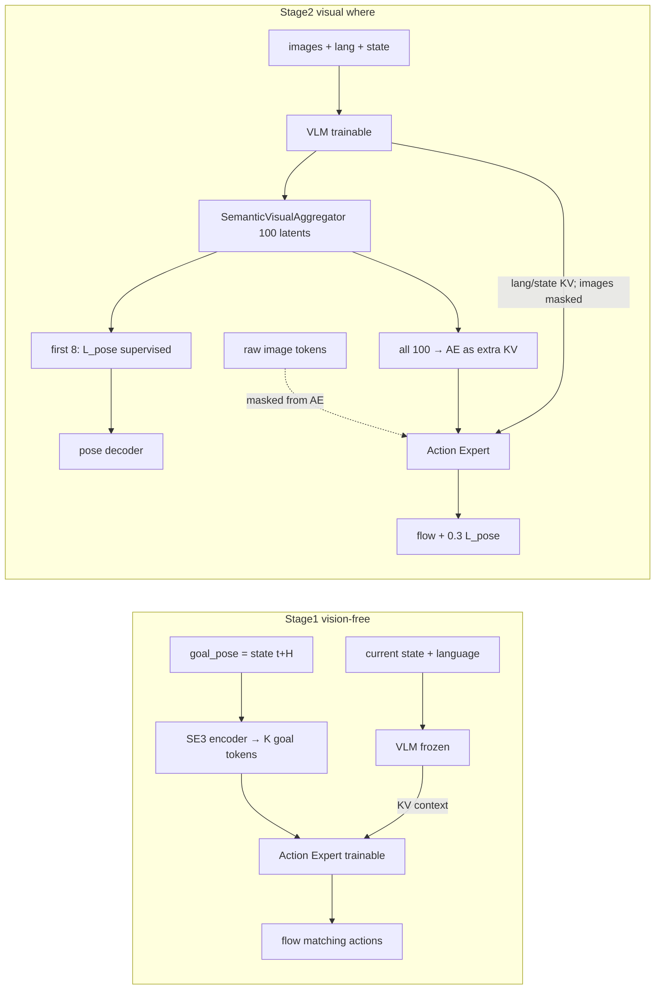

# Goal-Pose Prior V3 — 网络架构基线

本文档固化 **当前 V3 实现** 的两阶段网络与信息流，供后续改动对照，避免搞错
Stage1/Stage2 分工、token 划分、mask 与 loss。

- **不预设优化方案**；改架构时另开说明。
- V3 **不改模型代码结构**：= **v2b 架构** + 修正后的 `observation.state` / `action` QUANTILES。
- 评测常用 ckpt：`lerobot/outputs/libero_goal_prior_v3/seed_1000/stage2/checkpoints/025000/pretrained_model`
  （已与该目录 `config.json` 核对下表超参）。

相关入口：

| 文档 / 脚本 | 作用 |
| --- | --- |
| [README.md](README.md) | 为何修 stats、训练流程 |
| [IMPLEMENTATION.md](IMPLEMENTATION.md) | 相对 v2b 的变更范围（仅 stats） |
| [train_stage1.sh](train_stage1.sh) / [train_stage2.sh](train_stage2.sh) | 训练 flags |
| `lerobot/src/lerobot/policies/molmoact2/modeling_molmoact2.py` | `_SemanticVisualAggregator`、L_pose、image mask |

---

## 一句话定位

**V3 = v2b（scheme-2a semantic-visual recurrent）+ 重算 QUANTILES。**

Stage2 关键配置（与 `025000` config 一致）：

| 项 | 值 |
| --- | --- |
| `num_semantic_visual_tokens` | 100 |
| `num_semantic_visual_pose_tokens` | 8（仅前 8 进 L_pose） |
| `semantic_visual_num_layer_groups` | 6 |
| `semantic_visual_enable_self_attention` | true |
| `mask_image_from_action_expert` | true |
| `pose_recon_loss_weight` | 0.3 |
| `target_pose_delta_index` / `chunk_size` | 10 |
| VLM / ViT / connector LR | `1e-5`（warmup 1k / ViT 2k） |
| AE / semantic-visual LR | `1e-4`（warmup 5k；对齐 StarVLA：VLM 继承、AE 随机系） |

---

## 总体角色分工（idea → 实现）

- **Stage1**：学 **how**（无图、GT goal EE 条件）。
- **Stage2**：学 **where**（视觉聚合 goal），并继续训 how；设计意图是 AE **看不到原始 image token**，视觉只能经 latent 进入。

---

## Stage1（v3）

入口：[train_stage1.sh](train_stage1.sh)

| 项 | 值 |
| --- | --- |
| 视觉 | `disable_visual_input=true` |
| 可训 | `train_action_expert_only=true`（AE + goal SE3；VLM 冻） |
| Goal | `goal_token_source=se3_encoder`，`num_goal_tokens=4` |
| 目标位姿 | `target_pose_delta_index=10` = chunk 终点 `state[t+H]`（归一化） |
| Loss | 仅 flow matching（无 L_pose） |
| Bootstrap | Molmo2-ER VLM + 随机 AE |
| 步数 | 10k，bs 128/卡（默认） |

Goal 经 SE(3) encoder 成 4 个 token，进入 AE 条件路径。推理探针必须真正注入
`batch['goal_pose']`（Stage1 `se3_encoder` 须走 policy prefill 路径）。

---

## Stage2（v3 = v2b scheme-2a）

入口：[train_stage2.sh](train_stage2.sh)

| 项 | 值 |
| --- | --- |
| 模式 | `goal_conditioning_mode=semantic_visual_recurrent` |
| Latent 总数 | **100** |
| Pose 组 | **前 8** — 仅这 8 个进 L_pose |
| Context 组 | **后 92** — **无 pose 监督，但仍进 AE** |
| 隐维 / 头 | 768 / 8 heads，FFN×4 |
| 层组 | **6** groups（VLM 隐层数须能被 6 整除） |
| Self-attn | **开**（latent 间通信，pose↔context 可混信息） |
| 图像→AE | `mask_image_from_action_expert=true` |
| Loss | `L_flow + 0.3 * L_pose` |
| 初始化 | 强制 v3 Stage1 `010000` |
| 步数 | 30k，bs 32/卡（默认）；VLM + AE + aggregator 全开 |

### 每层信息流（训练 / 推理同构）

1. VLM decoder layer → hidden（lang / state / image patches）。
2. Aggregator：可选 **self-attn(100)** → **cross-attn(semantic=lang/state)** → **cross-attn(visual=image)**。
3. 100 latent 经 `project_kv` → 拼到该层给 AE 的 **context KV**（与 VLM KV concat）。
4. AE 该层 cross-attend 这份 KV：**无** raw image；有 **全部 100 latent** + 非 image 的 VLM token。
5. `L_pose` 只读 `latent[:, :8]` → LayerNorm → `_GoalPoseDecoder` → 重建归一化 `goal_pose`；
   推理缓存为 `get_last_goal_pose_norm()`（POSE_VIZ 红点）。

代码注释（scheme-2a）：

> only the first `num_semantic_visual_pose_tokens` are supervised by L_pose …
> **all tokens still condition the action expert**.

因此 Stage2 是 **软瓶颈**：8 token 有 pose 监督，但 92 context + self-attn 仍可把视觉/布局信息送进 AE。

---

## 与「解耦假设」的对照

| 设计意图 | 当前实现 | 备注 |
| --- | --- | --- |
| 视觉不直灌 AE | raw image 对 AE mask | 成立 |
| where 经 pose bottleneck | 仅 8 token 有 L_pose | **部分**：92 context + self-attn 仍可旁路 |
| how 复用 Stage1 | Stage2 从 Stage1 AE 初始化并继续训 | AE 可被 Stage2 视觉捷径改写 |
| goal = 未来 EE | `state[t+10]` 监督 | 与训练布局相关；非显式物体坐标 |

基线一句话：当前 V3 Stage2 是 **「8 pose 监督 + 100 全量 steer AE」的软瓶颈**，不是「仅 pose 条件 how」的硬瓶颈。

---

## 数据 / 归一化（V3 相对 v2b 的唯一结构性差异）

- 重算 state/action q01/q99（尤其 Z 不再 clip 到 ~0.88）；见 [fix_stats.sh](fix_stats.sh)。
- Goal pose 与 L_pose 目标均在 **QUANTILES 归一化空间**。
- 评测 overlay 须用 preprocessor / ckpt 的 q01/q99 反归一化，不可把 `[-1,1]` 当世界坐标。

---

## 改架构前检查清单

改动前请对照本文确认：

1. 动的是 Stage1（SE3 / 无图）还是 Stage2（aggregator / mask / L_pose）？
2. 100 latent 中哪些进 AE、哪些有 L_pose？
3. `mask_image_from_action_expert` 是否仍符合设计意图？
4. `goal_pose` 监督信号是否仍是 `state[t+H]`（归一化）？
5. 新实验是否需要新 `OUTPUT_DIR` / 版本后缀，避免覆盖 v3-25k 基线？
