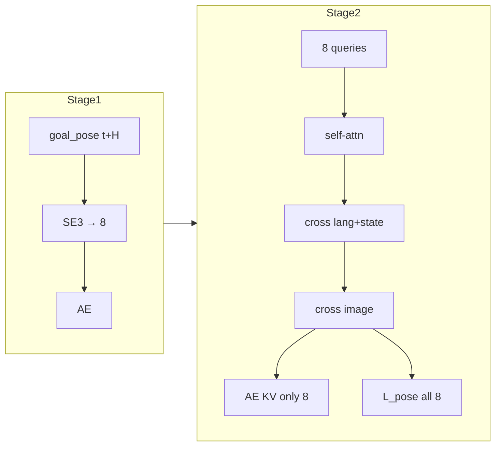

# Goal-Pose Prior V4 — 网络架构

相对 [V3 基线](../libero_goal_prior_v3/ARCHITECTURE.md) 的**硬瓶颈**配方。  
共享代码保持兼容：默认仍是 100/8；仅本目录脚本显式传入 `8/8`。

## 差分一览

| 项 | V3 | V4 |
| --- | --- | --- |
| Stage1 `num_goal_tokens` | 4 | **8**（SE3） |
| Stage2 latents | 100 = 8 + 92 context | **仅 8 pose** |
| 进 AE | 全部 100 | **仅 8** |
| L_pose | 前 8 | **全部 8** |
| Aggregator | self → lang/state → image，6 groups | **同序同组数** |
| image→AE mask | on | on |
| QUANTILES | v3 重算 | **复用 v3** |
| Stage2 LR / warmup | VLM `1e-5`（wu 1k）；AE+SV `1e-4`（wu 5k） | **同左**（对齐 StarVLA：VLM 继承、AE 随机系） |

## 兼容性

- `MolmoAct2Config` 允许 `pose_tokens <= total`（含相等）；默认仍 `100/8`、`num_goal_tokens=4`。
- `pose < total` 时行为与 V3 软瓶颈相同（不删 context 路径）。
- 不修改 `libero_goal_prior_v2b/` / `libero_goal_prior_v3/` 脚本。
